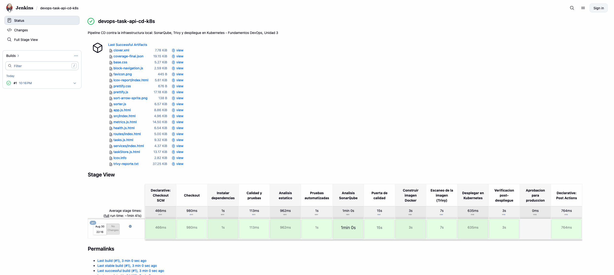
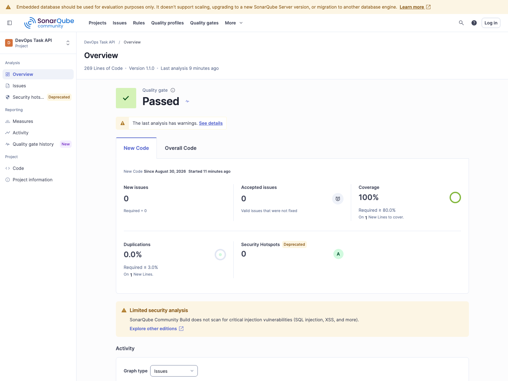
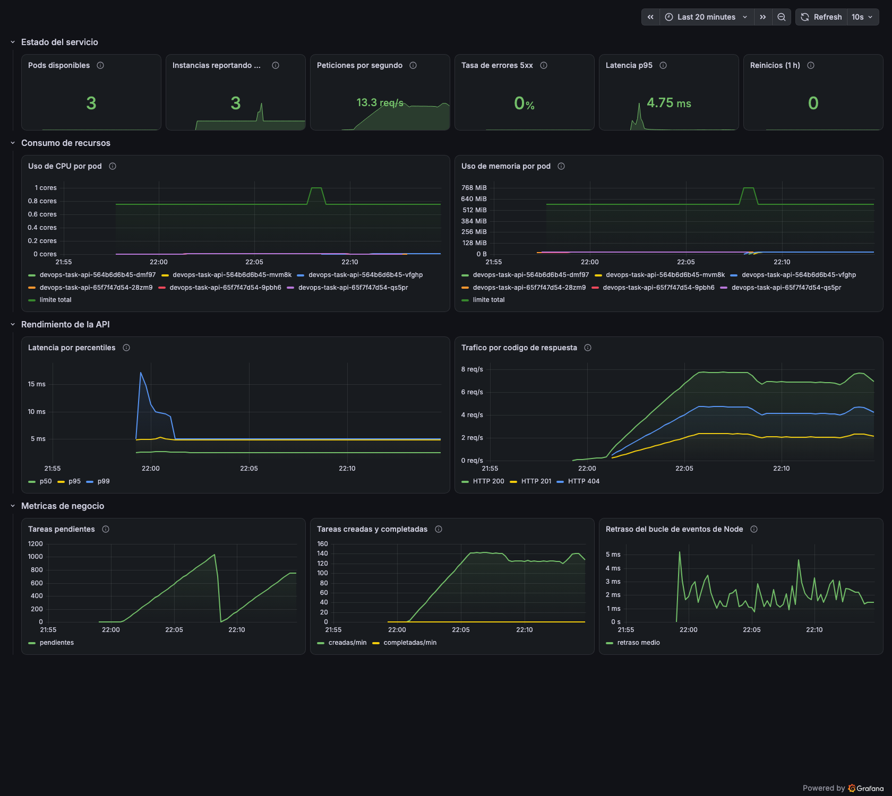
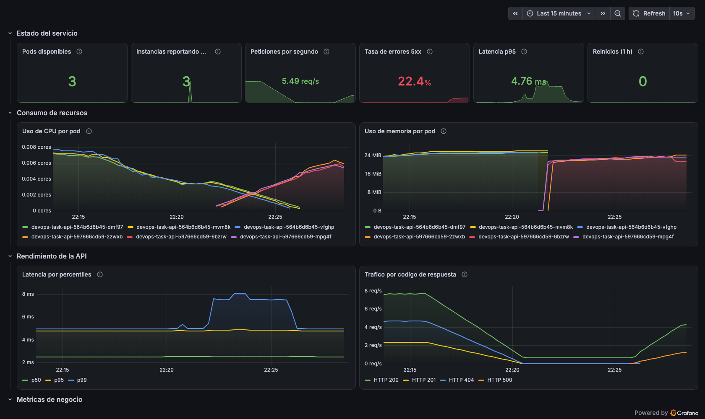

# Pipeline CI/CD con seguridad y monitoreo sobre Kubernetes

*Documentación técnica del laboratorio*

| | |
|---|---|
| **Institución** | Universidad de La Sabana |
| **Asignatura** | Fundamentos DevOps |
| **Unidad** | 3 — Ecosistema DevOps: herramientas para CI/CD y monitoreo |
| **Actividad** | 1 — Laboratorio técnico |
| **Autor** | David Santiago Iriarte Zamora |
| **Fecha** | 30 de agosto de 2026 |
| **Repositorio** | https://github.com/dsiriarte/devops-task-api |

---

## 1. Objetivo y alcance

Implementar un pipeline CI/CD completo que integre prácticas de seguridad y
monitoreo sobre una aplicación web desplegada en Kubernetes.

Esta fase parte de la anterior, donde los pipelines quedaron definidos pero el
despliegue era simulado por no disponer de un entorno de contenedores. El salto
de esta etapa es que todo se ejecuta de verdad: la aplicación corre en un
clúster real, Prometheus recolecta sus métricas, Grafana las presenta, SonarQube
analiza el código y Trivy la imagen. No queda ningún paso simulado.

| Componente | Estado en la unidad 2 | Estado en esta unidad |
|---|---|---|
| Pipeline CI | Ejecutándose en GitHub Actions | Ampliado con escaneo de seguridad |
| Pipeline CD | Definido, con pasos simulados | Ejecutado contra un clúster real |
| Despliegue en Kubernetes | Manifiestos escritos | 3 pods corriendo y observados |
| Análisis estático | ESLint | SonarQube con puerta de calidad |
| Análisis de dependencias | npm audit | npm audit + Trivy |
| Monitoreo | Inexistente | Prometheus, Grafana y 6 alertas |

## 2. Infraestructura del laboratorio

| Elemento | Tecnología | Versión |
|---|---|---|
| Runtime de contenedores | Docker sobre Colima | 29.5.2 |
| Orquestador | Kubernetes (k3s) | v1.35.0 |
| Servidor de CI | GitHub Actions | — |
| Servidor de CD | Jenkins LTS | 2.568.2 |
| Análisis estático | SonarQube Community | 26.8.0 |
| Escáner de vulnerabilidades | Trivy | 0.74 |
| Recolección de métricas | Prometheus (kube-prometheus-stack) | chart 88.6.1 |
| Visualización | Grafana | 13.2.0 |
| Aplicación | Node.js 24 · Express | 1.1.1 |

El stack de observabilidad se instaló con Helm mediante `kube-prometheus-stack`,
que despliega en una sola operación el Prometheus Operator, Prometheus,
Alertmanager, Grafana, node-exporter y kube-state-metrics. Se prefirió el chart
agrupado sobre la instalación individual porque resuelve por sí mismo las
integraciones entre componentes, que es justamente la parte frágil de montar
observabilidad a mano.

## 3. Flujo CI/CD de extremo a extremo

```
  Desarrollador
       │  git push
       ▼
  ┌─────────────────────── GitHub Actions (CI) ───────────────────────┐
  │  lint (ESLint)  │  test (Node 22 y 24)  │  security (npm audit +  │
  │                 │                       │   Trivy sobre el código)│
  │                 └───────── en paralelo ─────────┘                 │
  │                              ▼                                     │
  │            build: imagen Docker → Trivy → prueba de humo           │
  └────────────────────────────────┬───────────────────────────────────┘
                                   │  código validado
                                   ▼
  ┌──────────────────────── Jenkins (CD) ─────────────────────────────┐
  │  1 Checkout          5 Puerta de calidad     8 Desplegar en k8s   │
  │  2 Dependencias      6 Construir imagen      9 Verificación       │
  │  3 Calidad y pruebas 7 Trivy sobre imagen   10 Aprobación (prod)  │
  │  4 Análisis SonarQube                                             │
  └────────────────────────────────┬───────────────────────────────────┘
                                   ▼
                    ┌──────── Clúster Kubernetes ────────┐
                    │  namespace devops-lab · 3 réplicas │
                    │  Service · HPA · ServiceMonitor    │
                    └──────────────┬─────────────────────┘
                                   │  /metrics cada 15 s
                                   ▼
                    ┌──── Prometheus ──── Grafana ────┐
                    │  6 reglas de alerta · 13 paneles │
                    └──────────────────────────────────┘
```

### 3.1 Por qué SonarQube vive en Jenkins y no en GitHub Actions

Es una decisión de arquitectura, no de comodidad. La instancia de SonarQube está
autoalojada y solo es accesible desde la red local; los *runners* de GitHub
Actions se ejecutan en la nube y no pueden alcanzarla. Jenkins, en cambio, corre
junto al clúster y junto a SonarQube.

Esta separación reproduce la disposición habitual en organizaciones que mantienen
sus herramientas de análisis dentro de su perímetro: la CI pública valida lo que
puede validarse sin acceso interno, y la CD corporativa ejecuta lo que requiere
estar dentro de la red.

## 4. Pipeline de Integración Continua

**Archivo:** `.github/workflows/ci.yml`

| Job | Contenido | Qué protege |
|---|---|---|
| `lint` | ESLint sobre todo el código | Errores de estilo y construcciones sospechosas |
| `test` | Jest con cobertura, matriz Node 22 y 24 | Comportamiento sobre las dos LTS vigentes |
| `security` | npm audit + Trivy sobre el código | Dependencias con vulnerabilidades conocidas |
| `build` | Imagen Docker → Trivy → prueba de humo | Que el artefacto se construya, esté limpio y arranque |
| `summary` | Tabla de resultados | Lectura inmediata del estado |

Los tres primeros corren en paralelo; `build` depende de los tres. Un fallo de
estilo se reporta en menos de un minuto sin gastar tiempo construyendo una imagen
destinada a descartarse.


**Figura 1.** Ejecución del workflow de CI, con los seis *jobs* en verde y las
dependencias entre ellos.

## 5. Pipeline de Entrega Continua

**Archivo:** `jenkins/Jenkinsfile.local`

| # | Stage | Propósito |
|---|---|---|
| 1 | Checkout | Clona el repositorio y registra el commit exacto |
| 2 | Instalar dependencias | `npm ci` para una instalación determinista |
| 3 | Calidad y pruebas | ESLint y Jest en paralelo; archiva la cobertura |
| 4 | Análisis SonarQube | Escáner en contenedor, con el informe LCOV de cobertura |
| 5 | Puerta de calidad | Consulta el resultado y **detiene la entrega** si no se supera |
| 6 | Construir imagen Docker | Artefacto inmutable etiquetado por versión |
| 7 | Escaneo Trivy | Vulnerabilidades del sistema base y dependencias transitivas |
| 8 | Desplegar en Kubernetes | `kubectl apply` + `rollout status` |
| 9 | Verificación post-despliegue | Prueba de humo desde un pod efímero |
| 10 | Aprobación para producción | Puerta manual, solo si `DEPLOY_ENV == prod` |

El stage 5 es el que convierte el análisis en un control efectivo. Sin él,
SonarQube sería un informe que nadie lee; con él, un resultado adverso detiene la
entrega antes de que la imagen exista.



**Figura 2.** Ejecución completa del pipeline de CD en Jenkins: las catorce
etapas en verde, incluidos el análisis de SonarQube (1 min), la puerta de
calidad, el escaneo de Trivy y el despliegue en Kubernetes.

## 6. Seguridad integrada

El detalle completo está en [`docs/seguridad/informe-seguridad.md`](seguridad/informe-seguridad.md).
Resumen de resultados:

| Herramienta | Superficie analizada | Resultado |
|---|---|---|
| SonarQube | Código propio | 0 bugs, 0 vulnerabilidades, 0 code smells, puerta Passed |
| npm audit | Dependencias declaradas | 0 vulnerabilidades |
| Trivy | Imagen del contenedor | De 6 vulnerabilidades altas a 0 |



**Figura 3.** Panel de SonarQube tras el análisis: puerta de calidad superada,
sin incidencias nuevas y 100 % de cobertura sobre el código nuevo.

### 6.1 El hallazgo más instructivo

Trivy encontró seis vulnerabilidades altas en la imagen 1.1.0. Ninguna provenía
del código escrito ni de las dependencias elegidas: dos venían de OpenSSL en la
imagen base de Alpine y cuatro de las dependencias internas del propio `npm`,
que viaja dentro de la imagen oficial de Node.

La corrección fue doble: aplicar los parches del sistema operativo con
`apk upgrade`, y eliminar npm del contenedor de ejecución. La aplicación se
ejecuta con `node`, nunca con `npm`; mantener el gestor de paquetes solo aportaba
superficie de ataque. Las seis vulnerabilidades pasaron a cero.

La segunda medida es la más valiosa porque no parchea una vulnerabilidad
concreta: elimina el lugar donde esa clase de vulnerabilidad puede aparecer.

### 6.2 Un falso positivo y por qué no se «corrigió»

SonarQube marcó un `TODO` pendiente en `scripts/smoke-test.js`. Al revisarlo, la
regla había coincidido con la palabra española *todo* en la frase «si todo
responde correctamente». Se marcó como falso positivo dejando el razonamiento
registrado en la incidencia, en lugar de reescribir el comentario.

Alterar el código para acallar a una herramienta habría degradado la
documentación real del proyecto. Un analizador estático produce hipótesis, no
veredictos, y alguien tiene que triarlas.

## 7. Monitoreo y observabilidad

### 7.1 Instrumentación de la aplicación

La aplicación expone `/metrics` en formato Prometheus mediante `prom-client`, con
tres familias de métricas:

1. **Del proceso Node**: CPU, memoria residente, retraso del bucle de eventos,
   descriptores abiertos.
2. **De la capa HTTP**: histograma de duración de peticiones y contador total,
   ambos etiquetados por método, ruta y código de respuesta.
3. **Del negocio**: tareas creadas, completadas y pendientes.

Incluir métricas de negocio es deliberado. Un sistema puede tener CPU, memoria y
latencia en verde mientras deja de hacer aquello para lo que existe; observar
solo la infraestructura deja ciego a ese fallo.

**Cardinalidad.** El middleware etiqueta las rutas con `req.route.path` y no con
`req.path`, de modo que `/api/tasks/1` y `/api/tasks/2` se agregan bajo
`/api/tasks/:id`. Sin esa precaución, cada identificador generaría una serie
temporal nueva y el número de series crecería sin límite hasta degradar a
Prometheus. Hay una prueba automatizada que verifica precisamente esto.

### 7.2 Descubrimiento declarativo

Un `ServiceMonitor` declara qué servicios raspar y con qué frecuencia; el
Prometheus Operator lo traduce a configuración real. La alternativa, que sería
editar la configuración de Prometheus a mano, dejaría el monitoreo fuera del
control de
versiones, que es exactamente el problema que Kubernetes resuelve para todo lo
demás.

### 7.3 Dashboard

El tablero está declarado como código en un `ConfigMap` que el *sidecar* de
Grafana carga automáticamente. Vive versionado en el repositorio en lugar de
existir solo dentro de la base de datos de Grafana, donde no se revisa ni se
puede reproducir.

Consta de trece paneles en cuatro secciones:

| Sección | Paneles |
|---|---|
| Estado del servicio | Pods disponibles, instancias reportando, peticiones/s, tasa de errores 5xx, latencia p95, reinicios |
| Consumo de recursos | CPU por pod, memoria por pod (con el umbral de alerta marcado) |
| Rendimiento de la API | Latencia p50/p95/p99, tráfico por código de respuesta |
| Métricas de negocio | Tareas pendientes, ritmo de creación y finalización, retraso del bucle de eventos |



**Figura 4.** Dashboard en operación normal: 3 pods disponibles, 13.3 peticiones
por segundo, 0 % de errores y latencia p95 de 4.75 ms.

Se vigila la latencia por percentiles y no el promedio, porque el promedio
esconde justamente los casos que el usuario sufre: con 95 peticiones de 5 ms y 5
de 2 segundos, el promedio parece aceptable mientras uno de cada veinte usuarios
espera dos segundos.

### 7.4 Alertas

Seis reglas agrupadas por naturaleza del síntoma:

| Alerta | Condición | Severidad | Espera |
|---|---|---|---|
| `AplicacionCaida` | Ninguna instancia responde | critical | 1 min |
| `PodsInsuficientes` | Menos de 2 réplicas disponibles | warning | 2 min |
| `ReinicioFrecuenteDePods` | Más de 2 reinicios en 10 min | warning | 1 min |
| `TasaDeErroresElevada` | Más del 5 % de respuestas 5xx | critical | 2 min |
| `LatenciaAlta` | p95 por encima de 500 ms | warning | 3 min |
| `MemoriaCercaDelLimite` | Consumo sobre el 85 % del límite | warning | 5 min |

Todas alertan sobre síntomas que el usuario percibe (errores, lentitud, caída)
y no sobre causas internas. Una alerta que nadie puede accionar solo
genera ruido, y un sistema de alertas ruidoso termina ignorado, que es la forma
más común en que muere la monitorización.

El período de espera (`for`) evita que un pico transitorio dispare una alerta:
la condición debe sostenerse antes de notificar.

## 8. Validación del sistema completo

Para comprobar que la cadena funciona de extremo a extremo se **inyectó un
defecto deliberado** y se observó la respuesta del sistema. El análisis completo
está en el informe postmortem; aquí se resumen los resultados medidos:

| Momento | Hora (UTC) | Evento |
|---|---|---|
| T1 | 03:21:05 | Imagen defectuosa construida: ESLint y las 30 pruebas pasan |
| T3 | 03:21:50 | Desplegada. Los 3 pods superan las sondas de vida y disponibilidad |
| T5 | 03:25:45 | Comienza el tráfico de usuarios |
| T6 | 03:27:58 | La alerta `TasaDeErroresElevada` pasa a *firing* (23.4 % de errores) |
| T8 | 03:28:28 | Se ejecuta `kubectl rollout undo` |
| T9 | 03:29:05 | Rollback completado |
| T10 | 03:33:16 | La alerta vuelve a *inactive* |



**Figura 5.** El dashboard durante el incidente: tasa de errores en 22.4 %
marcada en rojo, aparición de respuestas HTTP 500 en el panel de tráfico y
sustitución de pods visible en las series de CPU y memoria.

**Tiempo de detección:** 2 min 13 s desde el primer tráfico afectado.
**Tiempo de recuperación:** 37 s desde la decisión de revertir.

El defecto pasó las 30 pruebas y el análisis estático porque estaba en una rama
condicionada a `NODE_ENV=production`, valor que fija el manifiesto de Kubernetes
pero que las pruebas nunca establecen. Ninguna puerta previa podía verlo: solo el
monitoreo en producción lo detectó. Es la demostración práctica de por qué la
observabilidad no es un complemento del pipeline sino la última de sus puertas.

## 9. Justificación de las herramientas

| Herramienta | Por qué se eligió |
|---|---|
| **GitHub Actions** | Integrada en el repositorio, sin infraestructura que mantener y con retroalimentación dentro del propio *pull request* |
| **Jenkins** | Control total sobre el proceso de entrega y acceso a la red interna donde viven SonarQube y el clúster; *pipeline as code* versionado junto a la aplicación |
| **SonarQube** | Análisis estático profundo con puerta de calidad configurable; autoalojado, los datos no salen del perímetro |
| **Trivy** | Cubre lo que SonarQube no ve —sistema operativo base y dependencias transitivas—, sin agente ni cuenta |
| **Prometheus** | Modelo de datos dimensional y lenguaje de consulta expresivo; estándar de facto en Kubernetes |
| **Grafana** | Visualización desacoplada de la recolección, con tableros declarables como código |
| **Helm** | Instala el stack de observabilidad como una unidad coherente, resolviendo las integraciones entre componentes |
| **Kubernetes** | Autorecuperación, escalado y despliegues progresivos con reversión inmediata |

Todas son de código abierto y neutrales respecto al proveedor de nube, de modo
que la misma arquitectura se ejecuta en un portátil, en AWS o en un centro de
datos propio.

## 10. Reflexión sobre eficiencia operativa

Con la automatización montada, el despliegue dejó de ser un procedimiento que
alguien ejecuta y pasó a ser una consecuencia de hacer `git push`. A partir de ahí
se encadenan validación, análisis, construcción, escaneo, despliegue y
verificación sin que nadie intervenga. El pipeline de entrega completo tarda 1 min
41 s, y de ese tiempo el análisis de SonarQube consume prácticamente un minuto.
Ese mismo trabajo hecho a mano me habría ocupado buena parte de una tarde, y lo
habría hecho de forma algo distinta cada vez.

Con la práctica terminada creo que el beneficio principal no está en la velocidad
sino en la reducción de la varianza. Un proceso automatizado ejecuta los mismos
pasos en el mismo orden siempre, mientras que uno manual varía según la prisa que
haya, el cansancio o quién lo ejecute. El incidente simulado lo dejó claro: la
recuperación tomó 37 segundos porque revertir era un comando conocido y no una
decisión improvisada bajo presión.

En términos de las métricas DORA, el laboratorio incide en las cuatro. La
frecuencia de despliegue aumenta porque desplegar deja de ser un evento. El *lead
time* queda en 1 min 41 s desde el commit hasta producción verificada. La tasa de
fallos se reduce por las cinco puertas de calidad que se atraviesan antes de que
la imagen llegue a existir. Y el tiempo de recuperación quedó medido en 37
segundos, con reversión automática configurada ante un fallo del pipeline.

También quedó visible un límite. La automatización desplaza el problema pero no lo
elimina, porque cada puerta detecta únicamente lo que sabe buscar. El defecto que
inyecté atravesó todas ellas porque vivía en una condición que ninguna prueba
ejercitaba. De ahí saco que el monitoreo en producción no es una red de seguridad
adicional sino el único control que observa el sistema tal como funciona, y que
conviene invertir en observabilidad tanto como en pruebas.

Hay un último hallazgo que prefiero dejar registrado porque me resultó incómodo.
Durante casi cuatro minutos la versión defectuosa estuvo desplegada sin que se
disparara ninguna alerta, simplemente porque no había tráfico que ejercitara la
ruta rota. La ausencia de alertas no significa que el sistema esté sano. Una sonda
sintética que ejercitara periódicamente las rutas críticas habría detectado el
fallo sin necesidad de que lo sufriera antes un usuario.

## 11. Conclusiones

El laboratorio integró en un mismo flujo la automatización, la seguridad y el
monitoreo, y los validó ejecutándolos contra infraestructura real en lugar de
limitarse a describirlos.

De los resultados obtenidos destaco tres. El primero es que la seguridad de un
contenedor se decide también en el momento de empaquetarlo: ninguna de las seis
vulnerabilidades encontradas estaba en el código que escribí, todas llegaron con
la imagen base y con herramientas que la aplicación ni siquiera utiliza en
ejecución. El segundo es que un análisis cuyo resultado no bloquea nada no llega a
ser un control; la puerta de calidad del stage 5 es lo que convierte a SonarQube
en algo más que un informe. El tercero es que la observabilidad acaba funcionando
como la última puerta del pipeline, porque el defecto inyectado superó el análisis
de estilo, las 30 pruebas y el análisis estático, y solo lo detectó la alerta de
tasa de errores, dos minutos y trece segundos después de empezar a afectar a los
usuarios.

El valor de esta arquitectura no está tanto en cada herramienta por separado como
en que cada una cubre el punto ciego de la anterior, y ninguna de ellas observa lo
que observa Prometheus cuando el sistema ya está en funcionamiento.

## Referencias

- Google. (s. f.). *How SRE relates to other disciplines*. https://sre.google/workbook/how-sre-relates/
- Humble, J., & Farley, D. (2010). *Continuous Delivery: Reliable Software Releases through Build, Test, and Deployment Automation*. Addison-Wesley Professional.
- Kim, G., Humble, J., Debois, P., Willis, J., & Forsgren, N. (2022). *Manual de DevOps: Transformación exitosa de equipos, herramientas e infraestructura* (2.ª ed.). dpunkt.
- Turnbull, J. (2014). *The Docker Book: Containerization is the new virtualization*. Turnbull Press.
