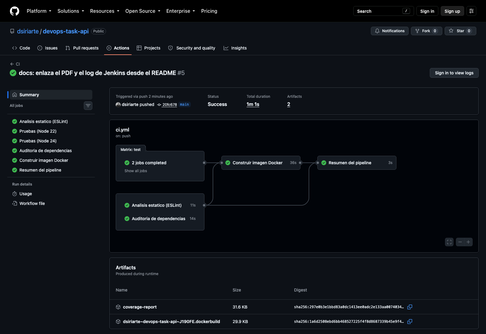
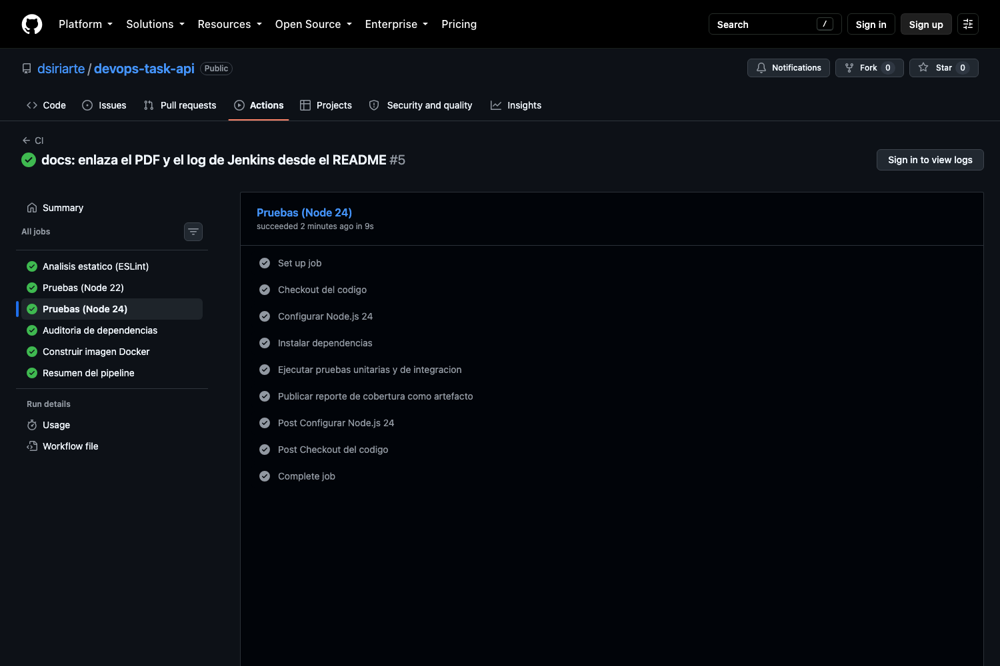
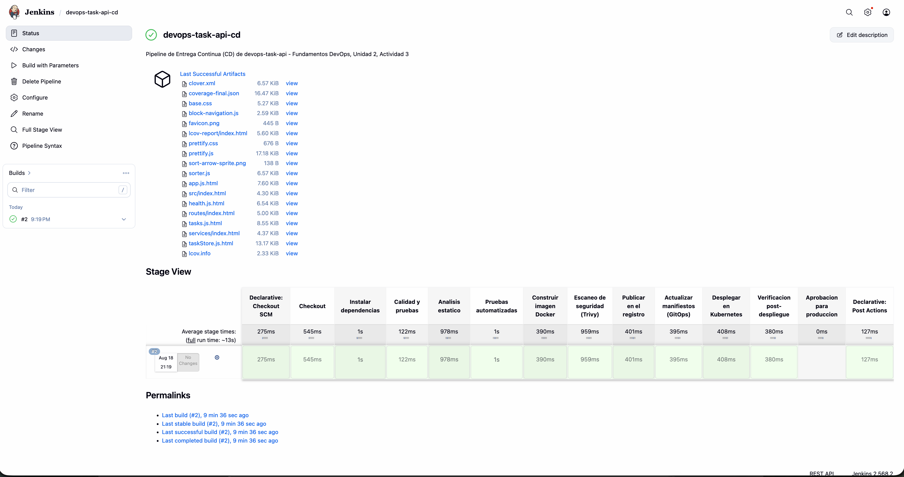
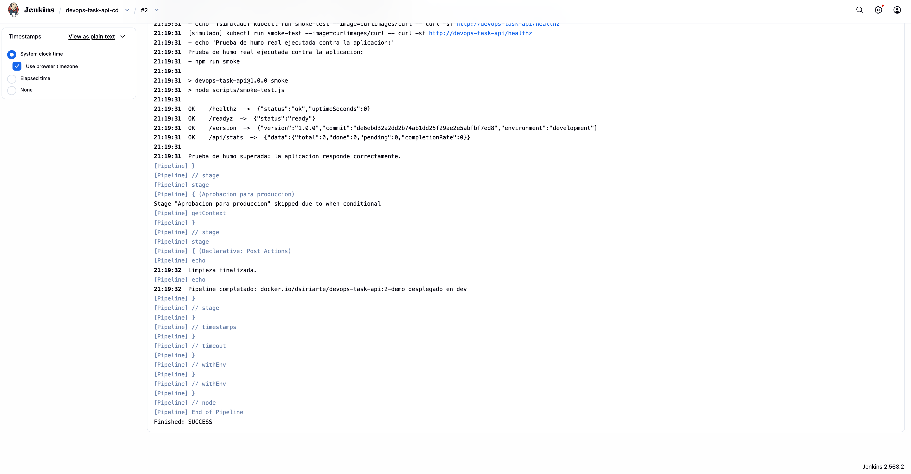

# Documentación técnica — Laboratorio técnico CI/CD

**Universidad de La Sabana — Fundamentos DevOps**
**Unidad 2: Flujos de entrega eficientes: CI/CD y automatización**
**Actividad 3 — Laboratorio técnico (Evaluativa)**

**Autor:** David Santiago Iriarte Zamora
**Fecha:** 18 de agosto de 2026
**Repositorio:** https://github.com/dsiriarte/devops-task-api

---

## 1. Objetivo del laboratorio

Configurar dos pipelines complementarios para una aplicación web cuyo código está
alojado en GitHub y cuyo destino de despliegue es un clúster de Kubernetes:

- **CI (Integración Continua) con GitHub Actions** — compilar, probar y validar el
  código de forma automática ante cada `push` y cada *pull request*.
- **CD (Entrega Continua) con Jenkins** — definir los *stages* del pipeline de
  despliegue de forma agnóstica al entorno de destino.

Esta entrega corresponde a la **primera fase del proyecto del módulo**: la
estructuración de los pipelines. Las fases posteriores abordarán la implementación
real sobre Kubernetes, los conectores de seguridad y la habilitación del monitoreo.
Por ello el diseño ya deja previstos —y documentados— los puntos de extensión hacia
esas fases: escaneo con Trivy, manifiestos de Kubernetes con sondas y contexto de
seguridad, y anotaciones de Prometheus en el *deployment*.

## 2. Aplicación construida

Se desarrolló **`devops-task-api`**, un gestor de tareas compuesto por una API REST
en Node.js/Express y una interfaz web estática que la consume.

La elección del dominio fue deliberada: se buscó una aplicación **realista pero sin
dependencias externas** (sin base de datos, sin servicios acompañantes, sin
credenciales de terceros), de modo que el pipeline pudiera ejecutarse de forma
íntegra y reproducible en cualquier *runner*, con tiempos de retroalimentación por
debajo del minuto. En un laboratorio de CI/CD **el objeto de estudio es el pipeline**,
no la complejidad del dominio.

| Componente | Tecnología | Justificación |
|---|---|---|
| Runtime | Node.js 24 LTS | Arranque rápido y ecosistema maduro de *tooling* para CI |
| Framework web | Express 4 | Estándar de facto, mínimo *overhead* |
| Pruebas | Jest + Supertest | Cobertura integrada con umbrales; Supertest prueba la API sin abrir puertos |
| Análisis estático | ESLint 9 (*flat config*) | Detección temprana de errores y homogeneidad de estilo |
| Contenedor | Docker (*multi-stage*) | Artefacto inmutable y portable entre entornos |
| Orquestación | Kubernetes | Autorecuperación, escalado y despliegues progresivos |

**Arquitectura interna.** La lógica de negocio (`src/services/taskStore.js`) está
separada de la capa HTTP (`src/routes/`), y la aplicación se exporta como una
*fábrica* (`src/app.js`) en lugar de como un servidor ya escuchando. Esta decisión
es directamente funcional al pipeline: permite montar la aplicación en las pruebas
con Supertest sin abrir puertos reales, lo que elimina los *tests* intermitentes
por colisión de puertos en los *runners* de CI.

### Cobertura de pruebas obtenida

```
---------------|---------|----------|---------|---------|
File           | % Stmts | % Branch | % Funcs | % Lines |
---------------|---------|----------|---------|---------|
All files      |     100 |     87.5 |     100 |     100 |
 src           |     100 |       50 |     100 |     100 |
  app.js       |     100 |       50 |     100 |     100 |
 src/routes    |     100 |    83.33 |     100 |     100 |
  health.js    |     100 |       75 |     100 |     100 |
  tasks.js     |     100 |     87.5 |     100 |     100 |
 src/services  |     100 |      100 |     100 |     100 |
  taskStore.js |     100 |      100 |     100 |     100 |
---------------|---------|----------|---------|---------|

Test Suites: 3 passed, 3 total
Tests:       23 passed, 23 total
```

Las 23 pruebas se reparten en tres suites: **unitarias** sobre la lógica de negocio
(`taskStore.test.js`), **de integración HTTP** sobre la API completa
(`tasks.api.test.js`) y sobre los *endpoints* de salud (`health.test.js`). Se
configuró en `package.json` un umbral mínimo de cobertura del 80 % de líneas: si
la cobertura desciende por debajo, el *build* falla. Esto evita la erosión
silenciosa de la calidad a medida que crece el código.

## 3. Pipeline de Integración Continua — GitHub Actions

**Archivo:** `.github/workflows/ci.yml`

### 3.1 Activación automática

```yaml
on:
  push:         { branches: [main, develop] }
  pull_request: { branches: [main] }
  workflow_dispatch:

concurrency:
  group: ci-${{ github.ref }}
  cancel-in-progress: true
```

El pipeline se dispara **automáticamente** ante cada `push` a `main` o `develop` y
ante cada *pull request* dirigido a `main`, cumpliendo el requisito de la guía.
`workflow_dispatch` permite además lanzarlo manualmente desde la interfaz. El
bloque `concurrency` cancela ejecuciones previas de la misma rama, de modo que un
`push` correctivo no espera a que termine el *build* del *commit* que corrige.

### 3.2 Etapas del pipeline

| Job | Contenido | Requisito de la guía |
|---|---|---|
| **`lint`** | Checkout → Node 22 → `npm ci` → `npm run lint` | Análisis estático (opcional) |
| **`test`** | Checkout → Node 22 y 24 (matriz) → `npm ci` → `npm test` → artefacto de cobertura | Checkout, dependencias, **pruebas** |
| **`security`** | Checkout → `npm audit --audit-level=high` | Extensión DevSecOps |
| **`build`** | Buildx → construir imagen → *smoke test* del contenedor | Extensión: validación del artefacto |
| **`summary`** | Tabla de resultados en el resumen de la ejecución | Retroalimentación |

Los tres primeros *jobs* se ejecutan **en paralelo**; `build` declara
`needs: [lint, test, security]` y solo arranca si los tres pasan. La consecuencia
práctica es que un error de estilo o una prueba rota se reportan en menos de un
minuto, sin consumir tiempo construyendo una imagen destinada a descartarse.

### 3.3 Decisiones técnicas y su fundamento

- **`npm ci` en lugar de `npm install`.** Instala exactamente las versiones fijadas
  en `package-lock.json` y falla si el *lockfile* está desincronizado. Es lo que
  hace que la construcción sea **reproducible**: el mismo *commit* produce siempre
  el mismo árbol de dependencias.
- **Matriz de versiones (Node 22 y 24).** Verifica el comportamiento sobre las dos
  versiones LTS vigentes. Se descartó deliberadamente Node 20, que alcanzó su fin de
  vida el 30 de abril de 2026: probar contra un *runtime* sin soporte da una falsa
  sensación de compatibilidad y no aporta información útil.
- **`cache: 'npm'` en `setup-node`.** Reutiliza el caché de dependencias entre
  ejecuciones, reduciendo el tiempo del pipeline y, con él, el *lead time*.
- **`permissions: contents: read`.** Principio de mínimo privilegio sobre el token
  del *workflow*: si el pipeline se ve comprometido, no puede escribir en el repo.
- **Artefacto de cobertura.** El reporte se publica con `upload-artifact` y queda
  descargable durante 7 días, dando trazabilidad de la calidad de cada ejecución.
- **Prueba de humo del contenedor.** Tras construir la imagen se levanta el
  contenedor y se consulta `/healthz` con reintentos. Verifica no solo que la
  imagen *se construye*, sino que **arranca y responde** — un fallo que la
  construcción por sí sola no detecta.

### 3.4 Evidencia de ejecución



**Figura 1.** Ejecución del *workflow* de CI en la pestaña Actions del repositorio,
con los cinco *jobs* completados.



**Figura 2.** Detalle del *job* de pruebas, con las 23 pruebas superadas y el
reporte de cobertura.


**Figura 3.** Resumen de la ejecución generado con `$GITHUB_STEP_SUMMARY`.

## 4. Pipeline de Entrega Continua — Jenkins

**Archivo:** `Jenkinsfile` (*pipeline declarativo*)

Conforme a la guía, en este pipeline lo evaluable es **la definición de los
stages**. Se optó por un `Jenkinsfile` declarativo versionado junto al código
(*pipeline as code*), de modo que el proceso de despliegue evoluciona con la
aplicación, se revisa en los mismos *pull requests* y queda auditado en el
historial de Git.

### 4.1 Stages definidos

| # | Stage | Propósito y justificación |
|---|---|---|
| 1 | **Checkout** | Clona el repositorio y captura *commit* y rama exactos en variables de entorno. Sin este registro no hay forma de responder "¿qué código exactamente está en producción?" |
| 2 | **Instalar dependencias** | `npm ci` para una instalación determinista |
| 3 | **Calidad y pruebas** | ESLint y Jest **en paralelo** (`parallel`); archiva la cobertura. Son independientes entre sí, así que paralelizarlos acorta el pipeline sin coste |
| 4 | **Construir imagen Docker** | Empaqueta la aplicación en un artefacto inmutable etiquetado `<build>-<commit>` |
| 5 | **Escaneo de seguridad (Trivy)** | Detecta CVEs en el sistema base y las dependencias **antes** de publicar la imagen: *shift-left security* |
| 6 | **Publicar en el registro** | `docker push` a DockerHub; la etiqueta `latest` solo se mueve desde `main` |
| 7 | **Actualizar manifiestos (GitOps)** | Sustituye la etiqueta de imagen en `k8s/deployment.yaml`, dejando el estado deseado declarado en Git |
| 8 | **Desplegar en Kubernetes** | `kubectl apply` seguido de `rollout status --timeout=180s`, que espera a que el despliegue converja realmente |
| 9 | **Verificación post-despliegue** | *Smoke test* contra el servicio ya desplegado, mediante un pod efímero `curlimages/curl` |
| 10 | **Aprobación para producción** | Puerta manual con `input`, activa solo cuando `DEPLOY_ENV == 'prod'` |

Los requisitos mínimos de la guía —clonar el repositorio, construir una imagen
Docker y publicarla en un registro— corresponden a los *stages* 1, 4 y 6. Los
demás se añadieron porque un pipeline de entrega que solo construye y publica deja
sin resolver la parte más delicada del problema: **verificar el despliegue y poder
deshacerlo**.

### 4.2 Requisitos del controlador Jenkins

El `Jenkinsfile` se validó con el *linter* declarativo de Jenkins
(`POST /pipeline-model-converter/validate`), que confirmó **`Jenkinsfile
successfully validated`** sobre Jenkins 2.568.2 LTS. Esa validación exige tener
instalados los siguientes *plugins*, que constituyen los requisitos previos para
ejecutar el pipeline:

| Plugin | Uso dentro del `Jenkinsfile` |
|---|---|
| `workflow-aggregator` | Soporte de *pipeline* declarativo |
| `git` | `checkout scm` |
| `github` | Disparador `triggers { githubPush() }` |
| `docker-workflow` | `docker.build`, `docker.withRegistry`, `image.push()` |
| `credentials-binding` | `withCredentials` para el `kubeconfig` |
| `timestamper` | Opción `timestamps()` |
| `ws-cleanup` | `cleanWs()` en el bloque `post` |
| `pipeline-stage-view` | Visualización de *stages* (Figura 4) |

Además, el agente que ejecute el pipeline debe disponer de `node`/`npm`, un
demonio Docker accesible, y los binarios `trivy` y `kubectl` en el `PATH`, junto
con las credenciales `dockerhub-credentials` y `kubeconfig-credentials`
registradas en Jenkins.

### 4.3 Despliegue agnóstico al entorno

El parámetro `DEPLOY_ENV` (`dev` / `staging` / `prod`) determina el *namespace* de
destino, y **el mismo pipeline sirve para los tres entornos** sin duplicar
definiciones. Más importante todavía: el artefacto **se construye una sola vez y se
promueve**. Lo que se validó en `dev` es exactamente el mismo binario que llega a
producción, lo que elimina por diseño la clase entera de fallos "funcionaba en
*staging*".

### 4.4 Gestión de secretos

Ninguna credencial aparece en el código. El pipeline referencia identificadores de
credenciales almacenadas en Jenkins (`dockerhub-credentials`,
`kubeconfig-credentials`) y las consume mediante `docker.withRegistry` y
`withCredentials`, que las inyectan como variables de entorno **enmascaradas en el
log**. Este es el requisito mínimo para que un `Jenkinsfile` pueda vivir en un
repositorio.

### 4.5 Manejo de fallos y recuperación

```groovy
post {
    failure {
        // Revierte el deployment a la revisión anterior
        sh "kubectl --namespace=${params.DEPLOY_ENV} rollout undo deployment/${IMAGE_NAME} || true"
    }
}
```

El bloque `post { failure }` ejecuta `kubectl rollout undo`, devolviendo el
*deployment* a la revisión anterior si cualquier *stage* falla. Junto con
`timeout(30, MINUTES)`, `disableConcurrentBuilds()` y las sondas de Kubernetes,
esto acota directamente el **tiempo medio de recuperación (MTTR)**, una de las
cuatro métricas DORA.

### 4.6 Evidencia de ejecución

Para generar evidencias reales se levantó una instancia local de **Jenkins 2.568.2
LTS** y se configuró el *job* `devops-task-api-cd` como *pipeline from SCM*
apuntando al repositorio. Se ejecutó la variante `jenkins/Jenkinsfile.demo`, que
replica exactamente los mismos *stages* sustituyendo por trazas únicamente las
operaciones que requieren un demonio Docker, un registro y un clúster reales
—inexistentes en el entorno del laboratorio— y ejecutando **de verdad** las etapas
de dependencias, análisis estático, pruebas, auditoría y prueba de humo.

Resultado de la ejecución (`build #2`, estado **SUCCESS**, 13,8 s):

```
Stage                                    Estado          Duración
------------------------------------------------------------------
Declarative: Checkout SCM                SUCCESS            0.3 s
Checkout                                 SUCCESS            0.5 s
Instalar dependencias                    SUCCESS            1.2 s
Calidad y pruebas                        SUCCESS            0.1 s
  ├─ Analisis estatico                   SUCCESS            1.0 s
  └─ Pruebas automatizadas               SUCCESS            1.7 s
Construir imagen Docker                  SUCCESS            0.4 s
Escaneo de seguridad (Trivy)             SUCCESS            1.0 s
Publicar en el registro                  SUCCESS            0.4 s
Actualizar manifiestos (GitOps)          SUCCESS            0.4 s
Desplegar en Kubernetes                  SUCCESS            0.4 s
Verificacion post-despliegue             SUCCESS            0.4 s
Aprobacion para produccion               NOT_EXECUTED       0.1 s   (DEPLOY_ENV=dev)
Declarative: Post Actions                SUCCESS            0.1 s
------------------------------------------------------------------
Finished: SUCCESS
```

El *stage* de aprobación aparece como `NOT_EXECUTED` porque la ejecución se lanzó
con `DEPLOY_ENV=dev`: la condición `when { expression { params.DEPLOY_ENV == 'prod' } }`
funcionó como se esperaba, omitiendo la puerta manual en un entorno no productivo.

Extracto del log de la etapa de verificación post-despliegue:

```
+ npm run smoke
> node scripts/smoke-test.js

OK    /healthz    ->  {"status":"ok","uptimeSeconds":0}
OK    /readyz     ->  {"status":"ready"}
OK    /version    ->  {"version":"1.0.0","commit":"de6ebd3...","environment":"development"}
OK    /api/stats  ->  {"data":{"total":0,"done":0,"pending":0,"completionRate":0}}

Prueba de humo superada: la aplicacion responde correctamente.
```

El log completo de la ejecución se incluye en
[`docs/evidencia-jenkins-consola.txt`](evidencia-jenkins-consola.txt).



**Figura 4.** Vista de *stages* del pipeline en Jenkins. Se aprecian las diez
etapas definidas, todas en verde, junto con los artefactos de cobertura
archivados por la ejecución.



**Figura 5.** Consola de la ejecución `#2`, con el resultado de la prueba de humo,
la omisión condicional del *stage* de aprobación y el `Finished: SUCCESS` final.

## 5. Contenerización

El `Dockerfile` emplea un **build multietapa**:

1. **Etapa `build`** — instala todas las dependencias y ejecuta `npm run lint` y
   `npm test`. Si la calidad no pasa, **la imagen no llega a existir**. Es una
   puerta de calidad adicional, independiente del pipeline.
2. **Etapa `runtime`** — parte de `node:24-alpine` limpia, instala solo
   dependencias de producción (`npm ci --omit=dev`) y copia únicamente `src/` y
   `public/`.

Medidas de seguridad aplicadas a la imagen:

- `USER node` — el contenedor **no corre como root**.
- `HEALTHCHECK` declarado a nivel de imagen.
- Copia selectiva de artefactos y `.dockerignore`, que reducen el tamaño final y
  la superficie de ataque.

El orden de las instrucciones aprovecha el caché de capas: `package*.json` se copia
antes que el código, de modo que `npm ci` solo se reejecuta cuando cambian las
dependencias, no en cada cambio de código.

## 6. Manifiestos de Kubernetes

| Archivo | Contenido |
|---|---|
| `k8s/deployment.yaml` | 3 réplicas, `RollingUpdate` con `maxUnavailable: 0`, sondas de *liveness* y *readiness*, `requests`/`limits` de CPU y memoria, `runAsNonRoot`, `readOnlyRootFilesystem`, `capabilities.drop: [ALL]` y anotaciones de Prometheus |
| `k8s/service.yaml` | `ClusterIP` que expone el puerto 80 hacia el 3000 del contenedor |
| `k8s/hpa.yaml` | Autoescalado horizontal de 3 a 10 réplicas al 70 % de CPU |

`maxUnavailable: 0` combinado con la sonda de *readiness* garantiza un **despliegue
sin interrupción del servicio**: ningún pod antiguo se retira antes de que el nuevo
esté listo para recibir tráfico. Las anotaciones `prometheus.io/scrape` dejan
preparada la fase de monitoreo del proyecto.

## 7. Justificación de las herramientas seleccionadas

| Herramienta | Justificación |
|---|---|
| **GitHub Actions** | Integrado de forma nativa en el repositorio: cero infraestructura que mantener, *runners* gestionados y retroalimentación visible dentro del propio *pull request*. Es la opción con menor curva de aprendizaje para CI en un proyecto ya alojado en GitHub, factor decisivo en equipos con poca madurez DevOps |
| **Jenkins** | Máxima extensibilidad (más de 1.800 *plugins*) y control sobre el proceso de entrega, incluida la capacidad de desplegar hacia infraestructura propia y de definir puertas de aprobación. Su modelo de *pipeline as code* permite versionar el proceso junto al código |
| **Docker** | Estandariza el entorno de ejecución: el mismo artefacto corre igual en el portátil del desarrollador, en el *runner* de CI y en el clúster, resolviendo el problema del "en mi máquina funciona" (Turnbull, 2014) |
| **Jest + Supertest** | *Framework* de pruebas estándar del ecosistema Node, con cobertura y umbrales integrados sin configuración adicional |
| **ESLint** | Análisis estático que detecta errores reales y unifica el estilo, reduciendo la carga cognitiva de las revisiones de código |
| **Trivy / npm audit** | Escaneo de vulnerabilidades en imagen y dependencias dentro del pipeline: la seguridad se desplaza a la izquierda del ciclo (DevSecOps) en lugar de ser una auditoría posterior |
| **Kubernetes** | Orquestación con autorecuperación, escalado horizontal y despliegues progresivos; destino natural de un artefacto contenerizado |

### ¿Por qué dos herramientas de CI/CD y no una sola?

No es redundancia, es **división de responsabilidades**. GitHub Actions resuelve la
integración continua con la mínima fricción posible para el desarrollador: vive en
el repositorio, comenta en el *pull request* y no exige mantener servidores.
Jenkins aporta lo que Actions no da con la misma facilidad en un contexto
corporativo: control sobre agentes propios, acceso a infraestructura interna,
puertas de aprobación y una trazabilidad de despliegues gobernada por la
organización.

Esta combinación refleja lo que ocurre en muchas organizaciones reales, donde la CI
vive junto al repositorio y el CD lo gobierna una plataforma corporativa con acceso
a la red de producción. También es coherente con la **separación entre CI y CD**
que recomiendan las prácticas actuales de GitOps y que se propuso en la Actividad 2
de esta misma unidad: la integración es **síncrona** ante un *commit* y busca
retroalimentación rápida; la entrega es **asíncrona** ante un cambio del estado
deseado y busca fiabilidad.

## 8. Relación con los principios DevOps

Siguiendo los *Tres Caminos* de Kim et al. (2022):

**Primer Camino — Flujo.** La automatización de extremo a extremo elimina las
transferencias manuales entre desarrollo y operaciones. El paralelismo en ambos
pipelines, el caché de dependencias y la cancelación de ejecuciones obsoletas
acortan el *lead time* desde el *commit* hasta el despliegue.

**Segundo Camino — Retroalimentación.** *Lint*, pruebas, auditoría de dependencias,
escaneo de imagen y *smoke tests* crean ciclos cortos y de derecha a izquierda: un
defecto se detecta en minutos, no en producción. El `rollout undo` automático y las
sondas de Kubernetes reducen el tiempo de recuperación cuando algo falla igualmente.

**Tercer Camino — Aprendizaje continuo.** Todo —código de aplicación, definición de
los pipelines y manifiestos de infraestructura— vive versionado en Git. Cada
despliegue se convierte así en un experimento **reversible y auditable**, lo que
habilita la experimentación segura y la mejora iterativa del propio proceso.

### Impacto sobre las métricas DORA

| Métrica | Cómo la aborda el diseño |
|---|---|
| **Frecuencia de despliegue** | Automatización completa: desplegar deja de ser un evento y pasa a ser una operación rutinaria |
| **Lead time para cambios** | Paralelismo de *jobs*, caché de dependencias y cancelación de ejecuciones superadas |
| **Tasa de fallos en cambios** | Pruebas, análisis estático, auditoría y escaneo como puertas de calidad previas al despliegue |
| **Tiempo de recuperación (MTTR)** | `rollout undo` automático, `rollout status` con *timeout* y sondas de Kubernetes |

## 9. Relación con la Actividad 2 y con las fases siguientes

Este laboratorio **implementa** el tramo Build → Test/Security → Release de la
arquitectura DevOps diseñada en la Actividad 2 de esta misma unidad, respetando las
herramientas allí seleccionadas y justificadas: GitHub y GitHub Actions para la
integración, Docker para el empaquetado, Jenkins para la orquestación de la
entrega, Trivy para el escaneo, y Kubernetes como destino de despliegue.

Los tramos que quedan por implementar en las fases siguientes del proyecto son:

- **Fase 2 — Implementación real sobre Kubernetes y conectores de seguridad.**
  El *stage* 7 ya deja el estado deseado declarado en Git, preparado para que
  Argo CD lo sincronice contra el clúster; los *stages* 5 y el `security` de CI son
  los puntos de anclaje de SonarQube y de los conectores de seguridad adicionales.
- **Fase 3 — Habilitación del monitoreo.** Las anotaciones
  `prometheus.io/scrape` del `deployment.yaml` y los *endpoints* `/healthz`,
  `/readyz` y `/version` de la aplicación son la superficie sobre la que se montará
  el stack Prometheus / Grafana / Loki.

## 10. Conclusiones

El laboratorio demuestra que la integración y la entrega continuas no son
simplemente "ejecutar comandos automáticamente", sino **el diseño de un conjunto de
puertas de calidad ordenadas por costo**: primero lo barato y rápido (análisis
estático, pruebas unitarias), después lo costoso (construcción de imagen, escaneo),
y finalmente lo irreversible (publicación y despliegue), con una puerta humana
antes de producción y un camino de vuelta automático si algo sale mal.

La combinación GitHub Actions + Jenkins permitió cubrir los dos extremos del
espectro: retroalimentación inmediata para el desarrollador y control gobernado
para el despliegue. Y el hecho de que ambos pipelines estén definidos como código
en el mismo repositorio que la aplicación significa que el proceso de entrega es
tan revisable, versionable y mejorable como el software que entrega — que es,
en última instancia, la idea central de DevOps.

## Referencias

- Kim, G., Humble, J., Debois, P., Willis, J. y Forsgren, N. (2022). *Manual de DevOps: Transformación exitosa de equipos, herramientas e infraestructura* (T. Demmig, trad.; 2.ª ed.). dpunkt.
- Lwakatare, L. E., Kuvaja, P., Oivo, M., Jedlitschka, A., Nguyen Duc, A., Felderer, M., Abrahamsson, P., Amasaki, S. y Mikkonen, T. (2016). Relationship of DevOps to Agile, Lean and Continuous Deployment: A Multivocal Literature Review Study. En *Product-Focused Software Process Improvement* (pp. 399–415). Springer International Publishing.
- Turnbull, J. (2014). *The Docker Book: Containerization is the new virtualization*. Turnbull Press.
